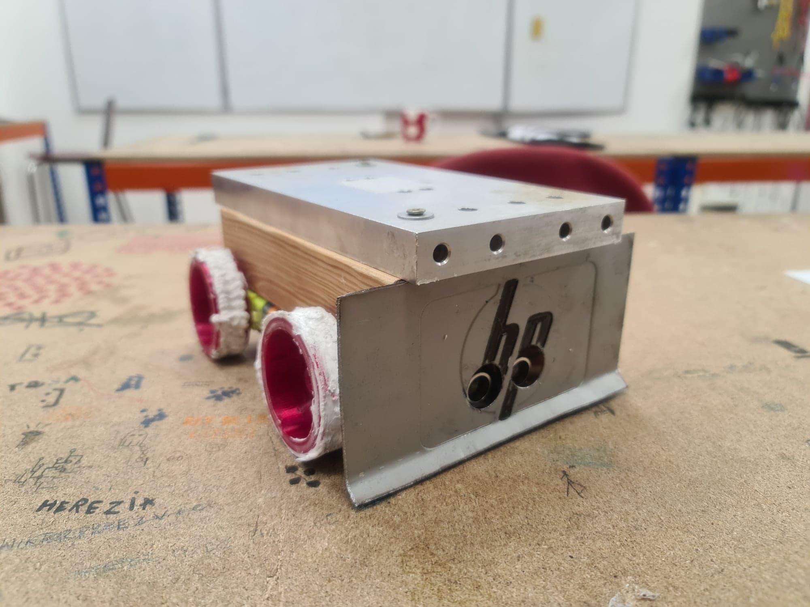

## BSR_sumo_22
Very basic sumo robot built for hackathon at BSR  
 
### Authors:  
rureq  
Gawron52  
 
### Hardware:  
- Arduino UNO  
- L298N Motor controller board    
- SR-04 Ultrasonic sensor  
- 3x CNY60 Reflective optical sensor  
- 4 generic yellow DC motors with gearboxes 
- Redox 2-cell, 7,4V, 700mAh Li-Po battery :battery:	
- 170 point breadboard
- Power switch
- Jumpers  
  
